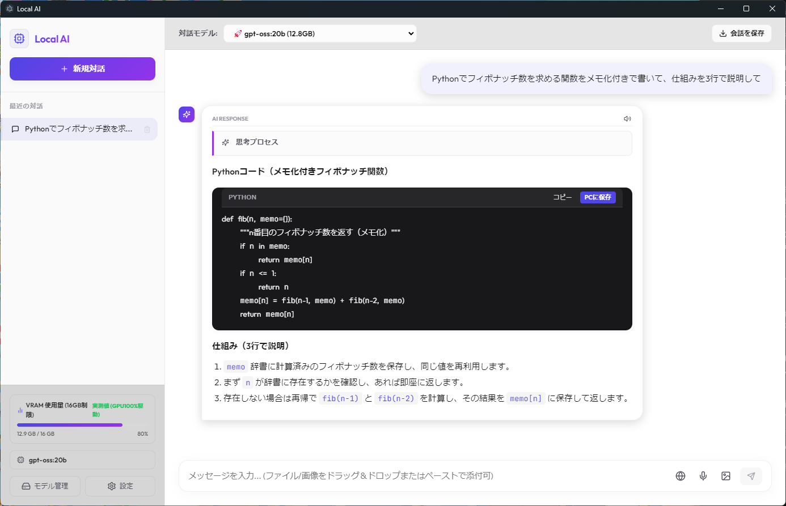
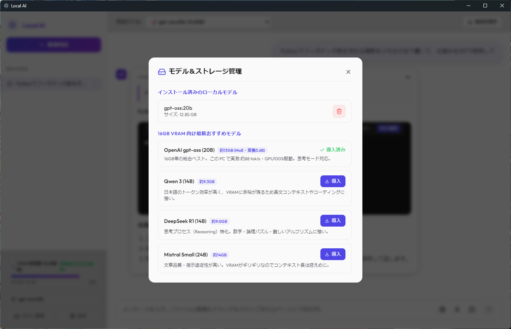

# Local AI

手元の PC で動くローカル LLM（Ollama）と、クラウドの Gemini API を1つの画面で切り替えて使えるデスクトップ AI チャットアプリです。
会話はすべて PC 内に保存され、ローカルモデルを使う限りインターネットにデータを送りません。



## 主な機能

- **ローカル LLM とチャット**（Ollama）: ストリーミング表示・生成の途中停止・思考プロセス（reasoning）の折りたたみ表示
- **Gemini API とチャット**: モデル一覧から選ぶだけでクラウドモデルに切り替え
- **Markdown / コード表示**: シンタックスハイライト、コードのコピー・ファイル保存
- **画像・テキストファイルの添付**: ドラッグ＆ドロップ／貼り付けに対応（画像対応モデルで画像を読ませる）
- **ネット検索**: 検索結果を回答の根拠として渡す
- **音声入力・読み上げ**: Web Speech API を使用
- **会話履歴**: 複数スレッドの保存・切り替え・Markdown ファイルへの書き出し
- **モデル管理**: 16GB VRAM 向けのおすすめモデルのダウンロード（進捗表示）・不要なモデルの削除
- **VRAM 使用量メーター**: モデルが GPU に収まっているか、メインメモリにはみ出していないかを表示
- **モデルに合わせたテーマ**: 選んだモデル（Gemini / Qwen / DeepSeek / Llama / Mistral など）に合わせて配色が自動で切り替わる
- **設定**: コンテキスト長・送る履歴の件数・システムプロンプト



## 技術スタック

- **Electron**（デスクトップアプリ化）+ **React 19** + **Vite**
- **Ollama REST API**（`/api/chat` のストリーミング、`/api/pull`・`/api/delete`・`/api/ps`）
- **Gemini API**（Server-Sent Events のストリーミング）
- **marked** + **DOMPurify**（Markdown の描画と XSS 対策）、**Prism.js**（コードのハイライト）

## 設計のポイント

- **通信はすべてメインプロセス経由**: 画面側（レンダラー）からは直接通信せず、`preload.js` の `contextBridge` で公開した IPC だけを使います（`contextIsolation: true` / `nodeIntegration: false`）。
- **通信先の許可リスト（SSRF 対策）**: 通信できるのはローカルの Ollama（`127.0.0.1:11434`）と Gemini API の公式ホストだけです。
- **API キーは暗号化して保存**: Gemini の API キーは Electron の `safeStorage`（Windows では DPAPI）で暗号化し、ソースコードや localStorage には平文で置きません。
- **ストリーミングの堅牢化**: ネットワークの区切りが JSON 行の途中に来ても欠けないよう、改行までバッファしてから処理します。生成を止めたときは接続ごと切断し、Ollama 側の推論も止めます。
- **起動を速く**: ビルド済みの `dist/` を直接読み込み、ソースが更新されたときだけ起動前に自動で再ビルドします（`scripts/ensure-build.js`）。

## セットアップ（Windows 10 / 11）

1. [Node.js 20 以上](https://nodejs.org/)をインストール
2. [Ollama](https://ollama.com/download) をインストール
3. このリポジトリをダウンロード（`git clone` または ZIP）
4. **`setup.bat` をダブルクリック**
   ライブラリのインストール → 画面のビルド → デスクトップにショートカット作成、まで自動で行います。
5. デスクトップの「Local AI」から起動し、左下の「モデル管理」でモデルを導入

`launch.bat` は、Ollama が起動していなければ起動してからアプリを開きます。

### Gemini を使う場合

[Google AI Studio](https://aistudio.google.com/apikey) で API キーを発行し、アプリの「設定」に入力してください（暗号化して PC 内に保存されます）。

### 開発用コマンド

```bash
npm run dev:app   # Electron + Vite 開発サーバー（別ターミナルで npm run dev）
npm run build     # dist/ を再ビルド
npm start         # 必要ならビルドしてから起動
```

## フォルダ構成

```
main.js              Electron メインプロセス（Ollama / Gemini 通信の中継、検索、ファイル保存、API キー管理）
preload.js           レンダラーに公開する IPC
src/
  App.jsx            状態管理（スレッド・設定・モデル選択・VRAM 計算）
  components/        ChatArea / Sidebar / ModelManager / SettingsModal
  utils/ollamaApi.js Ollama・Gemini API のラッパー（ストリーミング処理）
scripts/ensure-build.js  起動前の差分ビルド
```

## 動作環境の目安

おすすめモデルの一覧は **NVIDIA GPU・VRAM 16GB** を想定しています。VRAM が少ない PC では、`ollama pull qwen3:4b` などの小さいモデルを使ってください。
